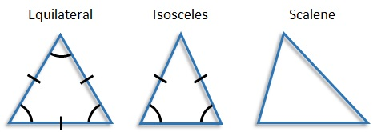

# Triangle challenge

Write a program that will determine the type of a triangle. It should take the lengths of the triangle's three sides as input, and return whether the triangle is equilateral, isosceles or scalene.
We are looking for solutions that showcase problem solving skills and structural considerations that can be applied to larger and potentially more complex problem domains. Pay special attention to tests, readability of code and error cases.

The way you reflect upon your decisions is important to us, why we ask you to include a brief discussion of your design decisions and implementation choices. 

The resulting code and discussion is vital for us and will be used as a way for us to validate your engineering skills. After having reviewed your code, we’ll decide on next step. 


# The assignment [](https://ci.appveyor.com/project/zionyx/the-assignment)



## Background

+ I had the initial idea to do the assignment with a new language I am still learning, Scala.
+ But found it rather difficult regarding the test tools and which library to use best for the task.
+ I reverted back to C# conservatively so I can find enough time to work on it.
+ Completed the work with Visual Studio 2015. See tools section below.

# Assessing the codes

## Required tools

1. Visual Studio 2012 / 2013 / 2015
(Professional / Enterprise Edition may be needed to run tests within Visual Studio)
1. .Net Framework 4.5
1. [Latest NuGet](https://www.nuget.org/)
1. Test tool: [NUnit 3.5](https://www.nuget.org/packages/NUnit/3.5.0)
1. Supportive test tool: [NUnit 3 Test Adapter 3.6.0](https://www.nuget.org/packages/NUnit3TestAdapter/3.6.0)

## Instructions to build the codes

1. Clone the repository.
1. Open [Triangle.Finder\Triangle.Finder.sln](Triangle.Finder\Triangle.Finder.sln) in Visual Studio.
1. Perform NuGet restore to download the required dependencies.
1. Via command line at the solution folder, [Triangle.Finder](Triangle.Finder).
    ```
    nuget restore Triangle.Finder.sln
    ```
1. Or in Visual Studio, right click **Solution Explorer > Restore NuGet Packages**.
1. From Visual Studio menu bar, **Build > Rebuild Solution**.

## Instructions to run the tests

*Professional / Enterprise edition of Visual Studio may be needed to run these tests within Visual Studio.*

1. In Visual Studio menu bar > **Test > Windows > Test Explorer**. 
1. Click **Run All** in Test Explorer.
1. Console output:
```
------ Run test started ------
NUnit Adapter 3.6.0.0: Test execution started
Running all tests in D:\Development\git.repos\The-Assignment\Triangle.Finder\Triangle.Finder.Test\bin\Debug\Triangle.Finder.Test.dll
NUnit3TestExecutor converted 4 of 4 NUnit test cases
NUnit Adapter 3.6.0.0: Test execution complete
========== Run test finished: 4 run (0:00:00.7650438) ==========
```

See build status about the assignment at [Appveyor.com](https://ci.appveyor.com/project/zionyx/the-assignment).
